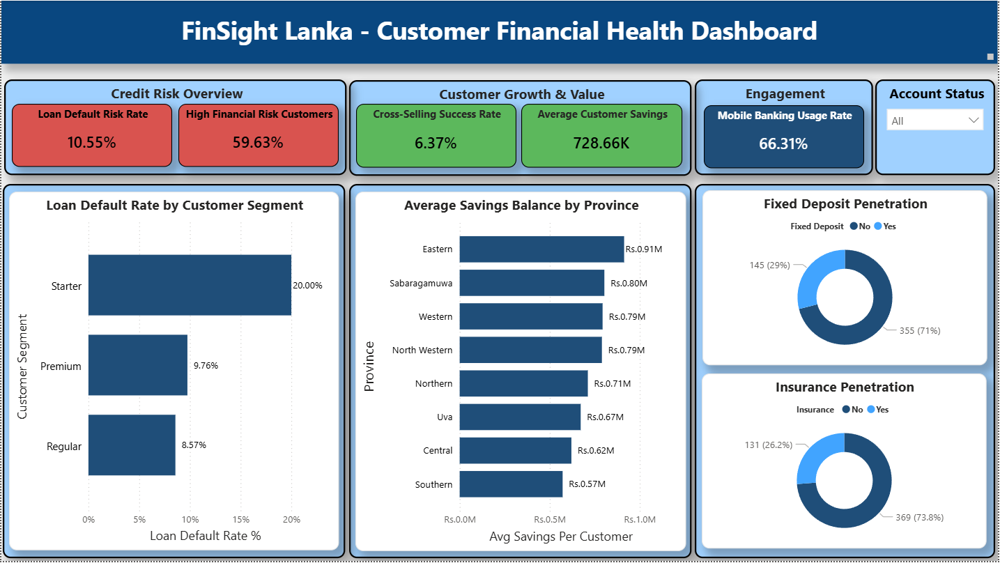

# FinSight Lanka — Analytics Trainee Assessment
### Dialog Finance | Customer Data Analysis | 2026


---

## 📌 Project Overview

This repository contains the full end-to-end data analytics assessment submitted for the **Dialog Finance Analytics Trainee position**. The assessment is based on the **FinSight Lanka** case study — a fictional fast-growing Sri Lankan fintech company offering digital savings accounts, personal loans, and a mobile wallet.

The analysis covers customer savings behaviour, loan portfolio risk, digital engagement, KPI development, strategic recommendations, and a self-critique of the analytical process.

**Dataset:** 500 customer records · 43 columns · 9 districts · Sri Lanka  
**Tools Used:** Python · PostgreSQL · Power BI · LaTeX

---

## 📂 Repository Structure

```
finsight-lanka-assessment/
│
├── data/
│   ├── raw/
│   │   └── FinSightLanka_Dataset_Raw.xlsx        # Original dataset (as received)
│   └── cleaned/
│       └── FinSightLanka_Dataset_Cleaned.xlsx    # Cleaned dataset (output of Step 0)
│
├── sql/
│   ├── Q1_Savings_CustomerBehaviour.sql          # Q1 queries + findings
│   ├── Q2_LoanPortfolio_Risk.sql                 # Q2 queries + findings
│   ├── Q3_DigitalEngagement_ProductHoldings.sql  # Q3 queries + findings
│   └── Q4_KPI_Definitions.sql                    # KPI calculation queries
│
├── python/
│   └── Step0_DataCleaning_FinSight.py            # Full data cleaning script
│
├── presentation/
│   └── FinSight_Lanka_Assessment.pptx            # 12-slide presentation
│
├── report/
│   └── Q5_Q6_BoardSummary_SelfCritique.pdf       # Written Q5 & Q6 answers (LaTeX)
│
├── dashboard/
│   └── screenshot/
│       └── PowerBI_Dashboard.png                 # [See dashboard screenshot below]
│
└── README.md
```

---

## 🔍 Assessment Questions & Approach

| # | Question | Tools Used |
|---|----------|-----------|
| Step 0 | Data Cleaning & Preparation | Python (pandas, numpy) |
| Q1 | Savings & Customer Behaviour | PostgreSQL |
| Q2 | Loan Portfolio & Risk Analysis | PostgreSQL |
| Q3 | Digital Engagement & Cross-Sell | PostgreSQL |
| Q4 | Define 5 KPIs + Dashboard | PostgreSQL + Power BI |
| Q5 | Board Summary & Recommendations | LaTeX / Word |
| Q6 | Critique of Own Analysis | LaTeX / Word |

---

## 🧹 Step 0 — Data Cleaning Summary

The raw dataset had **508 rows** with multiple quality issues. After cleaning, **500 valid records** remained.

| Issue | Severity | Action Taken |
|-------|----------|-------------|
| 8 duplicate Customer_IDs | HIGH | Removed — kept first occurrence |
| Impossible ages (4, 134, 150) | HIGH | Set to null — FSL-0034, 0089, 0271 |
| Sentinel value 999,999,999 in savings | HIGH | Replaced with null |
| Sentinel value 9,999,999 in withdrawals | HIGH | Replaced with null |
| 4 negative savings balances | HIGH | Set to null + flagged |
| 5 loan field contradictions | MEDIUM | Flagged for exclusion |
| Gender/Status/District formatting | LOW | Standardised via mapping |

---

## 📊 Key Findings

### Q1 — Savings & Customer Behaviour
- **Premium customers** average **LKR 2,655,800** — 32× more than Starter (LKR 82,628)
- **26-35 age band** holds the highest total savings (LKR 123.5M across 159 customers)
- **Urban customers** hold 33% more savings on average than Suburban customers
- 100% positive net monthly flow — flagged as a data quality anomaly (see Q6)

### Q2 — Loan Portfolio & Risk
- Loan penetration rate: **43.6%** of total customer base
- **59.4%** of loan customers (126/212) have DSR > 1.0 — total exposure: **LKR 130,101,268**
- **Starter segment** default rate: **17.1%** vs Premium: 9.8%
- **Vehicle loans** carry the highest default rate at **16.0%**
- Highest risk combination: **Starter segment + Vehicle loans**

### Q3 — Digital Engagement & Cross-Sell
- **251 customers (50%)** hold savings only — no Fixed Deposit, no Insurance
- Cross-sell pool collectively holds **LKR 222,385,272** in savings
- **Agent channel** has the lowest default rate (5.4%) — **Branch** has the highest avg savings (LKR 841,984)
- Non-app users hold slightly higher avg savings (LKR 798K) than app users (LKR 761K) — counter-intuitive finding

---

## 📈 Q4 — KPI Dashboard

Five KPIs defined to track monthly customer base health, spanning **Risk**, **Growth**, and **Engagement**.

| # | KPI | Area | Current Value | Target |
|---|-----|------|--------------|--------|
| 1 | Loan Default Rate | Risk | 10.1% | < 8% |
| 2 | High Risk Exposure (DSR > 1.0) | Risk | 59.4% | < 40% |
| 3 | Cross-Sell Penetration | Growth | 6.4% | > 35% |
| 4 | Mobile App Adoption | Engagement | 66.3% | > 75% |
| 5 | Avg Savings per Active Customer | Growth | LKR 728,656 | +10% YoY |

> All KPI values calculated from the **cleaned dataset** using **Active customers only** where applicable.

---

## 📊 Power BI Dashboard

> Dashboard built in Power BI, connected directly to PostgreSQL (`fintech` table).



*Replace the image above with your actual Power BI dashboard screenshot.*

---

## 💡 Q5 — Strategic Recommendations

**Recommendation 1 — Risk Management**  
Introduce risk-based lending controls for **Starter segment Vehicle loans** — the highest-risk combination in the portfolio. Apply stricter credit criteria to directly reduce the LKR 130M over-leverage exposure.

**Recommendation 2 — Revenue Growth**  
Launch a targeted cross-sell campaign for the **251 savings-only customers** holding LKR 222M. A 25% conversion rate would add ~LKR 55M in Fixed Deposit value and improve revenue per customer.

---

## ⚠️ Q6 — Limitations & Self-Critique

| Criticism | Severity |
|-----------|----------|
| 100% positive net monthly flow — statistically unrealistic, likely a dataset artefact | High |
| Small sub-group sample sizes make some rates unreliable for policy decisions | High |
| Eastern Province average possibly driven by outliers — median more appropriate | Medium |
| Cross-sell pool of 251 may be overstated without CRM interaction history | Medium |
| No income or employment data — DSR analysis is descriptive, not predictive | Medium |

---

## 🛠️ How to Reproduce

### 1. Clone the repository


### 2. Run data cleaning
```bash
pip install pandas openpyxl
python jupyter_notebooks_clean/01_clean_data.ipynb.py
```

### 3. Load cleaned data into PostgreSQL
```bash
# Create a database named 'database_db' (or your preferred name)
# Load the cleaned Excel file using pgAdmin or psycopg2
```

### 4. Run SQL queries
Open each `.sql` file in the `sql/` folder using **pgAdmin** or **psql** and run against your PostgreSQL database (`fintech` table).

### 5. Open Power BI Dashboard
- Open Power BI Desktop
- Get Data → PostgreSQL → connect to your local database
- Load the `fintech` table and apply the DAX measures from `Q4_KPI_Definitions.sql`

---

## 📋 Submission Checklist

- [x] Data cleaning script (Python)
- [x] SQL queries for Q1, Q2, Q3, Q4
- [x] Power BI dashboard (PDF export)
- [x] 12-slide PowerPoint presentation
- [x] Written Q5 & Q6 report (PDF)
- [x] README documentation

---


*This assessment was completed as part of the Dialog Finance Analytics Trainee recruitment process. All data used is fictional and provided solely for assessment purposes.*
